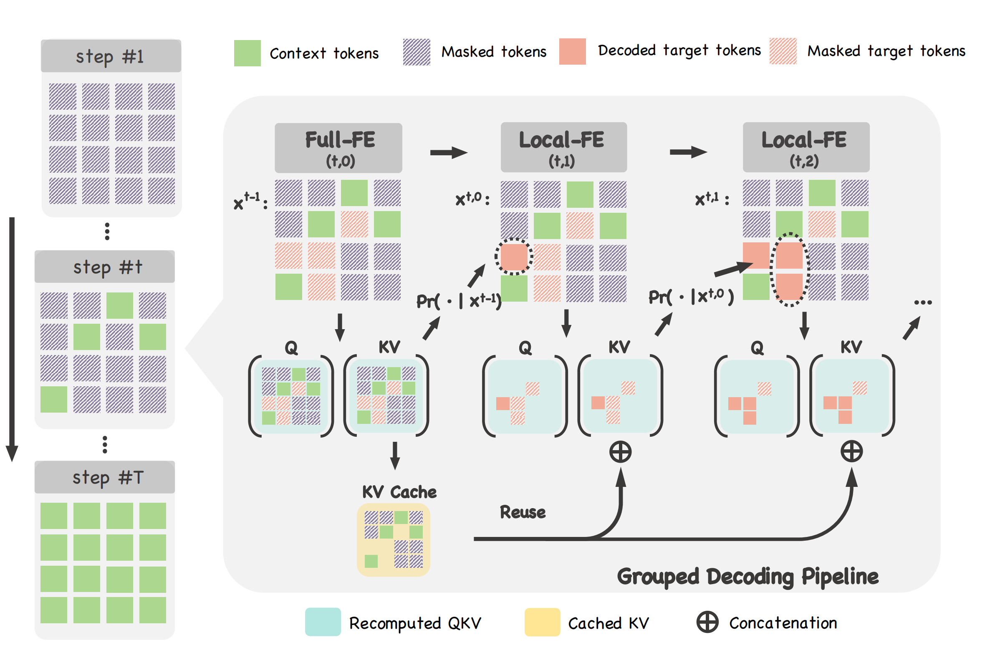

Official PyTorch Implementation of [Plug-and-Play Context Feature Reuse for Efficient
Masked Generation](https://arxiv.org/abs/2505.19089) (ReCAP).


## 🚀 Overview
ReCAP provides an efficient KV-caching mechanism for accelerating the inference of Masked Generative Models (MGMs) with bidirectional attention, achieving up to **3.2×** speedup with negligible quality loss. It is compatible with popular MGM framework such as [MaskGIT](https://arxiv.org/abs/2202.04200) and [MAR](https://arxiv.org/abs/2406.11838).



## 🔥 News
- [2024/05/27] The paper is released!
- [2024/05/28] The code is released!


## 🛠️ Environment Setup

```bash
conda create -n recap python=3.10
conda activate recap
pip install -r requirements.txt
```


## 📘 Example Usage
### 📌 MaskGIT-r + ReCAP
1. Download the pre-trained [VQGAN tokenizer](https://drive.google.com/file/d/13S_unB87n6KKuuMdyMnyExW0G1kplTbP/view?usp=sharing) to `assets/vqgan_jax_strongaug.ckpt`.
2. Download the pre-trained [MaskGIT](https://drive.google.com/file/d/12NN62Vg1DiOd-3sWkEnBQRIBBbuiVkNl/view?usp=sharing) to `examples/MaskGIT+ReCAP/ckpts/nnet_ema.pth`.
3. Run the following scripts to evaluate the pre-trained MaskGIT model with ReCAP:
```bash
cd examples/MaskGIT+ReCAP
bash run_maskgit_recap.sh
```


### 📌 MAR + ReCAP
1. Download the pre-trained [VAE](https://www.dropbox.com/scl/fi/hhmuvaiacrarfg28qxhwz/kl16.ckpt?rlkey=l44xipsezc8atcffdp4q7mwmh&dl=0) to `examples/MAR+ReCAP/pretrained_models/vae/kl16.ckpt`.
2. Download the pre-trained [MAR-L](https://www.dropbox.com/scl/fi/pxacc5b2mrt3ifw4cah6k/checkpoint-last.pth?rlkey=m48ovo6g7ivcbosrbdaz0ehqt&dl=0) to `examples/MAR+ReCAP/pretrained_models/mar_large/checkpoint-last.pth` and [MAR-H](https://www.dropbox.com/scl/fi/1qmfx6fpy3k7j9vcjjs3s/checkpoint-last.pth?rlkey=4lae281yzxb406atp32vzc83o&dl=0) to `examples/MAR+ReCAP/pretrained_models/mar_huge/checkpoint-last.pth`.
3. Run the following scripts to evaluate the pre-trained MAR models with ReCAP:
```bash
cd examples/MAR+ReCAP
bash run_mar_recap.sh
```

### 📊 Calculate FID/IS
1. Download the [FID-stats](https://drive.google.com/file/d/1C7DgARuZi9-InTYOgpkE3pggkJB6DMZD/view?usp=drive_link) to `assets/fid_stats/imagenet256_guided_diffusion.npz`.
2. Run the script `eval_metrics.py`


## 📄 Citation
If you find this work useful, please consider citing our paper:
```bibtex
@misc{liu2025recap,
      title={Plug-and-Play Context Feature Reuse for Efficient Masked Generation}, 
      author={Xuejie Liu and Anji Liu and Guy Van den Broeck and Yitao Liang},
      year={2025},
      eprint={2505.19089},
      archivePrefix={arXiv},
      primaryClass={cs.CV},
      url={https://arxiv.org/abs/2505.19089}, 
}
```

## 📮 Contact
For any questions, please feel free to contact us via email: [liebenxj@gmail.com]


## 🎉 Acknowledgements
This code is built upon the following repositories:
- [AutoNAT](https://github.com/LeapLabTHU/ImprovedNAT.git)
- [MAR](https://github.com/LTH14/mar.git)


